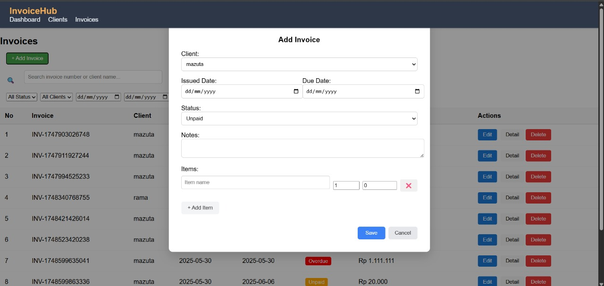
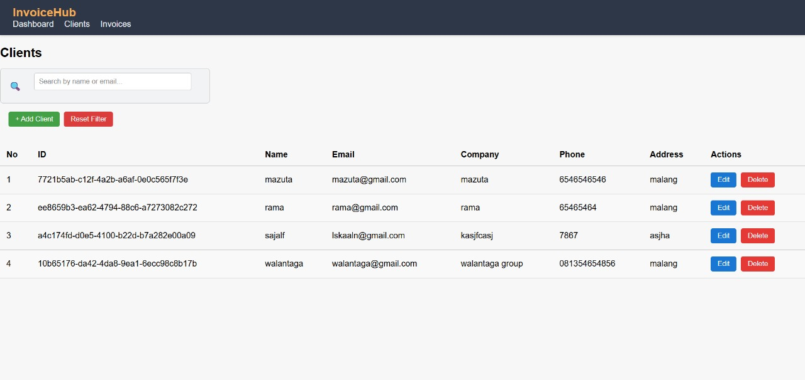
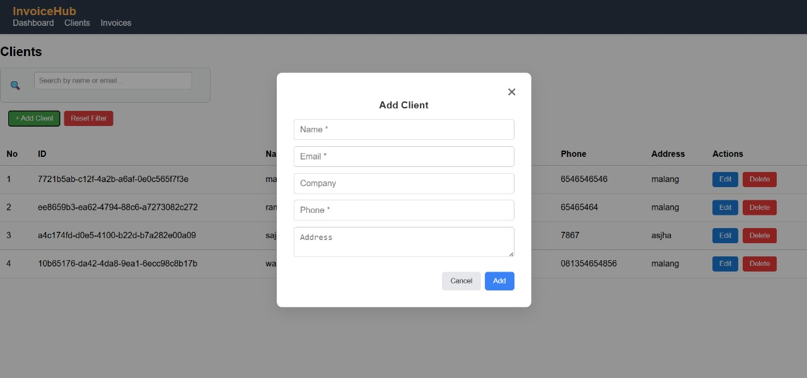
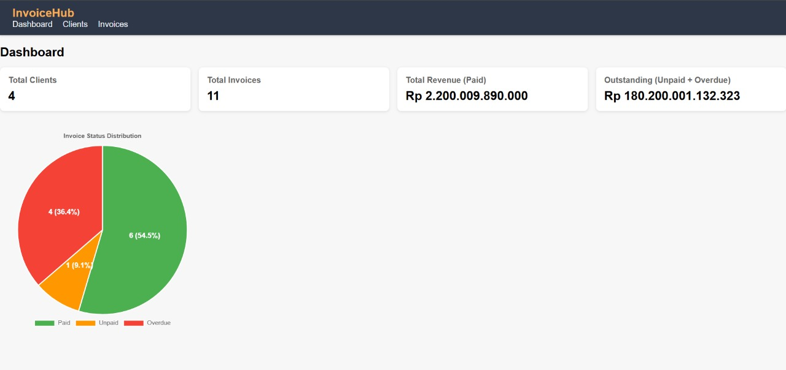
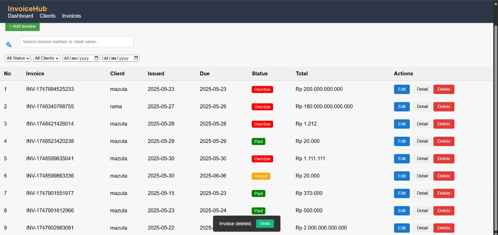

#InvoiceHub

InvoiceHub adalah aplikasi manajemen klien dan invoice berbasis vanilla JavaScript. Aplikasi ini dirancang modular dengan arsitektur maintainable, mendukung SPA (Single Page Application), serta dilengkapi fitur pencarian, filter, dan grafik dashboard.

## Fitur Utama

### Manajemen Invoice


- Tambah, edit, hapus invoice
  
- Detail invoice lengkap (items, notes, total, dll)
- Form dinamis untuk item (nama, qty, harga)
- Nomor invoice otomatis (`INV-{timestamp}`)

### Manajemen Klien



- Tambah, edit, hapus klien
  
- Validasi form (nama, email, telepon)

### Pencarian & Filter


- Cari invoice berdasarkan nomor atau nama klien
- Filter berdasarkan:
  - Status: Paid / Unpaid / Overdue
  - Klien
  - Rentang tanggal due

### Dashboard



- Cards ringkasan (Total Clients, Revenue, Outstanding)
- Pie Chart distribusi invoice (Paid, Unpaid, Overdue)

### Fitur Tambahan

- Undo delete invoice (5 detik)
  
- UI responsif
- Komponen UI reusable (modal, item row, dsb)
- Penyimpanan data via `localStorage`

---

## Arsitektur SPA & Routing

InvoiceHub menggunakan hash-based routing (`location.hash`) untuk mendukung SPA behavior tanpa framework:

| URL Hash         | Halaman           |
| ---------------- | ----------------- |
| `#/`             | Dashboard         |
| `#/clients`      | Manajemen Klien   |
| `#/invoices`     | Manajemen Invoice |
| `#/invoices/:id` | Detail Invoice    |

Routing dikendalikan oleh modul `router.js`, yang mendengarkan `window.onhashchange` dan me-render halaman sesuai jalur.

---

## Cara Menjalankan Secara Lokal

1. **Clone repository**
   ```bash
   git clone https://github.com/Walantaga77/InvoiceHub
   cd invoicehub
   ```
